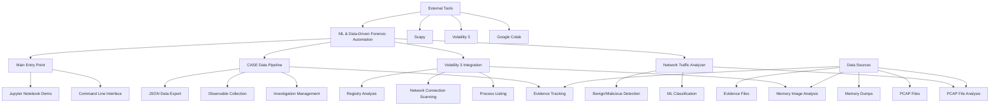

```mermaid
graph TD
    A[ML & Data-Driven Forensic Automation] --> B[Network Traffic Analyzer]
    A --> C[Volatility 3 Integration]
    A --> D[CASE Data Pipeline]
    
    B --> B1[PCAP File Analysis]
    B --> B2[ML Classification]
    B --> B3[Benign/Malicious Detection]
    
    C --> C1[Memory Image Analysis]
    C --> C2[Process Listing]
    C --> C3[Network Connection Scanning]
    C --> C4[Registry Analysis]
    
    D --> D1[Investigation Management]
    D --> D2[Evidence Tracking]
    D --> D3[Observable Collection]
    D --> D4[JSON Data Export]
    
    A --> E[Main Entry Point]
    E --> F[Command Line Interface]
    E --> G[Jupyter Notebook Demo]
    
    H[External Tools] --> A
    H --> H1[Scapy]
    H --> H2[Volatility 3]
    H --> H3[Google Colab]
    
    I[Data Sources] --> B1
    I --> C1
    I --> D2
    
    I --> I1[PCAP Files]
    I --> I2[Memory Dumps]
    I --> I3[Evidence Files]
```